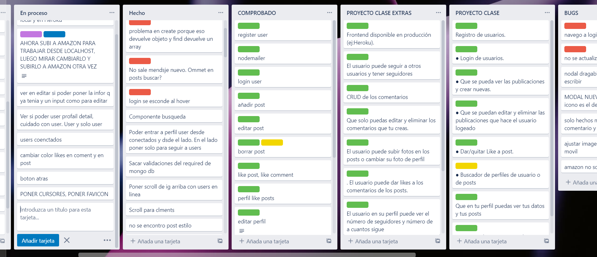
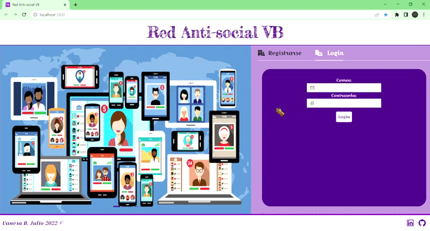
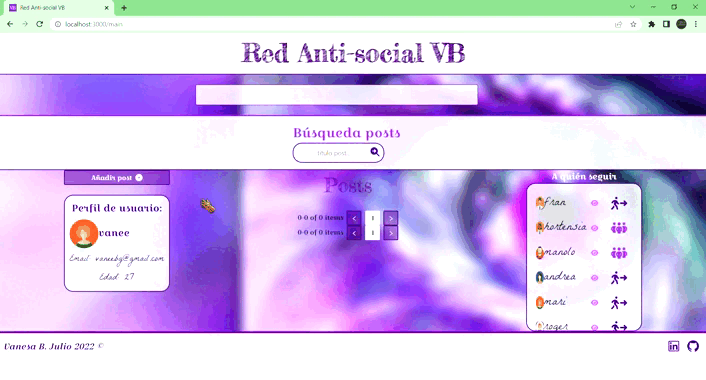
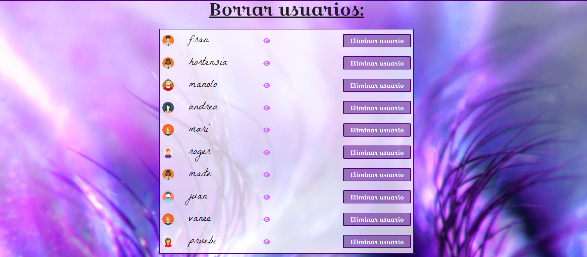
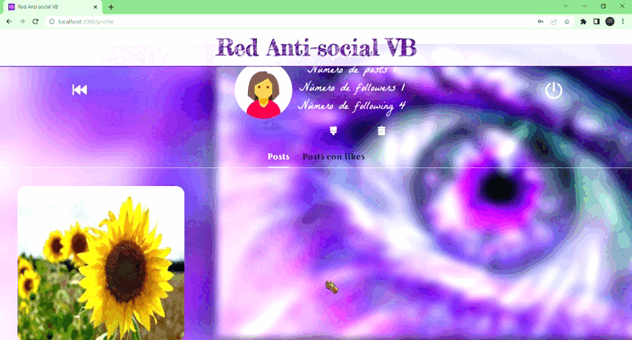
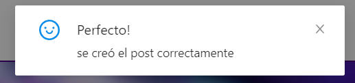
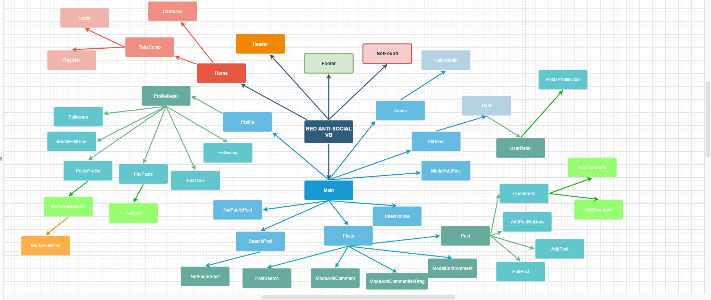

#  <center> :video_game: :space_invader: Proyecto FullStack: Read Anti-social VB :video_game: :space_invader: </center> 

 ## :clipboard: Índice :clipboard:

 - [Sobre el proyecto](#bookmarktabs-sobre-el-proyecto-bookmarktabs)

    - [Instalación y despliegue](#nutandbolt-instalación-y-despliegue)

    - [Tecnologías utilizadas](#wrench-tecnologiaspackages-utilizados)

    - [Origen](#dart-origen)

    - [Objetivos](#pushpin-objetivos)

    - [Inspiración](#cinema-inspiración)

- [Descripción del proyecto](#greenbook-descripción-del-proyecto-greenbook)

    - [API](#1-api)

    - [Componentes](#2-componentes)

    - [Redux](#2-componentes)

    - [React router](#4-react-router)


- [Retos presentados](#dart-retos-presentados-dart)

    - [UseEffect](#vista-admin)

    - [Extra-reducers]

    - [User y UserProfile]()

    - [CRUD de comentarios]()

    - [Paginación]()

    - [Despliegues]

    - [Cypress]

    -[Populate]

    - [Subir imágenes]()

    -[Permitir likes y comentarios cuando entras en perfil de otro usuario]()

    - [Modales draggables]()


- [Agradecimientos](#agradecimientos)

- [Futuras implementaciones](#blacknib-futuras-implementaciones-blacknib)

- [Autor](#raisedhands-autores-raisedhands)

------------------

# :bookmark_tabs: Sobre el proyecto :bookmark_tabs:


## :nut_and_bolt: Instalación y despliegue 

El proyecto se subirá a un repositorio público de GitHub.
Además, el backend procede de la API anteriormente creada para la red social en MongoDB: [Red Social API](https://github.com/vaneebg/BACKEND_MONGODB_RED_SOCIAL).
Para instalar este proyecto debes hacer lo siguiente: primero acceder desde github a los dos repositorios y proceder a clonártelos con el siguiente comando:
````
git clone https://github.com/vaneebg/PROJECT-FULL-STACK
git clone https://github.com/vaneebg/BACKEND_MONGODB_RED_SOCIAL
````
Una vez clonado el repositorio es muy importante que en tu consola instales todos los npm que necesita cada proyecto con el siguiente comando: 
````
npm i
````


Por último, en caso de querer correr en local, procede a levantar el servidor primero en el proyecto de backend con este comando:
```
npm start
```
Y después en el proyecto de frontend, entras con cd red-social-project/ y una vez dentro de la carpeta, levantas el servidor:
```
npm start
```

Automáticamente se te abrirá una nueva ventana del navegador con la página web.

Ambos repositorios están desplegados, el backend en Heroku y el frontend en Aamazon Web Service. En caso de querer acceder al proyecto desplegado, la página web es la siguiente:
https://main.d15f54lyfj7w5t.amplifyapp.com/


---------
## :wrench: Tecnologias/packages utilizados 
- Javascript
- React
- SASS
- Redux
- React Router
- React-draggable
- Axios
- NodeJS
- MongoDB
- Mongoose
- Bcrypt
- Jsonwebtoken
- Multer
- AntDesign
- Font awesome
- Cypress
- Cypress-file-upload
- Cypress-localstorage-commands
- Dotenv
- Trello

---------

## :dart: Origen 
Es el proyecto final de fullstack de la academia The Brigde para asentar todos los conocimientos aprendidos durate el bootcamp. En este caso, se ha utilizado React conjuntamente con Redux, esta vez adaptado para trabajar con la API de backend que hemos creado anteriormente para una red social, con lo cual se trabajan aptitudes anteriores, como el uso de Axios para llamar a nuestra API y el trabajo con NodeJS en caso de tener que modificar algo en la API para mejorar el funcionamiento. En lo referente al diseño, se ha seguido utilizando SASS y la librería AntDesign, que me ha proporcionado tanto nofificaciones, como formularios y modales entre otros, además de algunos iconos proporcionados por Font awesome.


Se ha trabajado en diversas ramas de Git para continuar con el proceso de aprendizaje de esta herramienta y fomentar las buenas prácticas. Primeramente se ha creado la rama develop y,a pesar de que trata de un trabajo individual, se hanido creando subramas con el nombre de la funcionalidad que se iba a implementar. Después se mergeaba develop primero en la subrama, y una vez comprobado que todo seguía en funcionamiento, se mergeaba a develop. Finalmente, una vez asegurado que todo el proyecto está en funcionamiento, se mergea a main.


Para la organización he hecho uso principalmente de Trello, dividiendo cada tarjeta por tareas, objetivos mínmos del proyecto, bugs y comprobaciones, así como nuevas ideas:


------
 
## :pushpin: Objetivos 

**GENERALES:**
- [X] Registro de usuarios.
- [X] Login de usuarios.
- [X] Que se pueda ver las publicaciones y crear nuevas.
- [X] Que se puedan editar y eliminar las publicaciones que hace el usuario logeado
- [X] Dar/quitar Like a post.
- [X] Buscador de perfiles de usuario o de posts
- [X] Que en tu perfil puedas ver tus datos y tus posts
- [X] Que puedas comentar en las publicaciones


Requisitos imprescindibles del proyecto:
- [X] Uso de ramas con git, cuando se termine el proyecto deberán quedar dos ramas la master o main y la develop.
- [X] Presentación de README excelente.


## 1.1.Red social

- Componentes mínimos:
    - [X] Register
    - [X] Login
    - [X] Home
    - [X] Posts
            - Post
            - AddPost
    - [X] Perfil. Vista perfil con los datos del usuario logeado y sus posts
    - [X] Header
    - [X] Footer
- [X] Implementa React Router en tu página
    - /home. Home de la app
    - /login
    - /register
    - /profile. 
- [X] Utilizar Redux
- [X] Readme Excelente
- [X] Uso de SASS
- [X] Importante el diseño

*Reglas:*
- [X] Los componentes no podrán sobrepasar las 400 líneas de código.
- [X] Las funciones no deberán sobrepasar las 75 líneas de código.


## 1.2. Extras
- [X] Frontend disponible en producción (ej:Heroku).
- [X] El usuario puede seguir a otros usuarios y tener seguidores
- [X] CRUD de los comentarios
- [X] Que solo puedas editar y eliminar los comentarios que tu creas.
- [X] El usuario puede subir fotos en los posts o cambiar su foto de perfil.
- [X] El usuario puede dar likes a los comentarios de los posts.
- [X] El usuario en su perfil puede ver el número de seguidores y número de a cuantos sigue
- [X] El usuario puede ver quien le sigue y a quién sigue
- [X] El usuario en su perfil puede ver los posts a los que le ha dado like
- [X] Implementación de guards
- [X] Que sea responsive


-------------------
## :cinema: Inspiración 
La idea principal con la que he construido este proyecto es intentar darle esa pincelada de toque personal. Para ello, se me ocurrió la idea de desmarcarme un poco de lo que conocemos normalmente como red social, siendo la misma subir tus mejores vacaciones o tus fotos de viajes y amigos. Al final, una red social no es más quee una herramienta de conexión entre las personas, y creo que si hay algo que una más que lo que nos encanta, es también lo que nos disgusta. De ahí su nombre, Red Anti-social. Me he dedicado sobre todo a enmarcar la idea de subir posts sobre aquellas cosas que te fastidia en tu vida cotidiana, desde madrugar, hasta coger transporte público. Siempre desde el humor,por eso son en forma de memes, ya que entre mis principios de vida, tener humor ha estado siempre entre los principales. 

Ya que setrata de una red anti-social, he pensado en un diseño se adapte a estas características, sobre todo al humor. Y qué mejor color que los tonos morados/rosas, como inspiración a esa vida de "color de rosa". Para ello, he utilizado una paleta de colores y tres tipos de fuentes principales que he puesto en el archivo variables.scss:


Para el fondo general de la página, he escogido una imagen con especial mención a un familiar muy querido, del mismo estilo con un attachment "fixed" para no tener los cortes de imagen y así ponerla estable en todo el fondo:


En Home hay una animación general en forma de Carrousel:


En cuanto al diseño en general, está basado en tarjetas que están levemente pintadas con transparencia, además de cursores personalizados haciendo especia mención al personaje más "asocial" de Marvel:



Vista perfil y vista perfil de otro usuario:


Vista modales draggables y scroll comentarios:


En lo referente a la vista Admin, tiene un panel de administración donde se borran los usuarios:



Para finalizar, siguiendo con la temática, he añadido gifs en caso de que no hayas posteado nada aún ni tengas post guardados en tus favoritos, aquí también se muestra el pop-up de seguridad enc aso de querer borrar un post:



Prácticamente toda la página web tiene diseñadas unas notificaciones que avisan al usuario de que ha hecho Login bien, ha añadido un comentario/post con éxito, entre otros:


----------
# :green_book: Descripción del proyecto :green_book:

## 1. API
La API a la que realizamos las llamadas es la que contruí en un proyecto anterior con base en MongoDB usando Mongoose. Toda la información acerca de la API la puedes encontrar aquí:
````
https://github.com/vaneebg/BACKEND_MONGODB_RED_SOCIAL
````
En el Readme se explican todos los endpoints y el funcionamiento en general de la misma.
----------

## 2. Componentes
Son un total de 42 componentes cada uno de ellos enlazado a su fichero scss y conectados de la siguiente forma:



Dos de ellos se encuentran fijados para aparecer siempre independientemente del componente al que te hayas dirigido:
- **Header:** Título de la página web.

- **Footer:** consta del nombre del autor junto con el año de creación. A mano derecha hay una serie de links dispuestos como iconos que redireccionan a las diferentes redes sociales.


Resto de componentes se ha organizado de forma que cada uno se especialice lo máximo posible en una única función. Por ejemplo, User se encarga de mapear los usuarios y mostrarlos en AllUsers, al igual que Post mapea todos los posts que hay y los muestra en el componente padre Posts.
-------

## 3. Redux
La parte fundamental sobre la que se sustenta el trabajo. 3 carpetas diferenciadas según si la información es del usuario (auth), si es perteneciente al los posts o si es de comentarios.
Primeramente, en el caso de formularios como Register, envía la información mediante dispatch al Slice que pertenezca, y ste ejecuta la acción de register, que no es más que la llamada a Service donde se hace la petición a la API. 

- **Auth**: importante la distinción entre user, referido al usuario que inicia sesión, y userProfile, perteneciente a los perfiles de usuarios que podrá ir visitando el usuario en linea.
````
const initialState = {
  user: user ? user : null,
  userProfile: null,
  isError: false,
  isSuccess: false,
  messageLogout: "",
  isLoading: false,
  message: "",
  users: [],
  usersOnline: []
};
````

-**Posts**: en lo referente al componente de features de posts, el estado inicial de posts en plural es un array vacío que espera llenarse con los objetos (los diferentes post). Por otro lado, post en singular está destinado a obtener el post por Id, que puedes conseguirlo al hacer click sobre tu propio post en tu perfil, o bien en el perfil de otro usuario.


````
const initialState = {
  posts: [],
  numberPosts: 0,
  post: {},
  isLoading: false,
  isError: false,
  isSuccess: false,
  message: "",
};
````

- **Comments:** Un estado inicial donde cada comentario que vayas creando será un nuevo objeto de comment.
````
const initialState = {
  comment: {},
  isLoading: false,
  isError: false,
  isSuccess: false,
  message: "",
  page: 1,
};
````


-----------

## 4. React router
Para la utilización de rutas en forma de Link en el proyecto, se instala este componente y se importa en nuestra App.jsx:
``````
import { BrowserRouter, Route, Routes } from "react-router-dom";
``````
Después, debemos poner todos los componentes entre los que queramos navegar dentro de estas etiquetas 'BrowserRouter' y los path a las rutas dentro de Routes. Gracias a esto, ahora podemos navegar entre los componentes:
`````
         <BrowserRouter>
        <Header />
        <Routes>
          <Route path="/" element={<Home />} />
          <Route path="/main" element={<PrivateZone><Main /></PrivateZone>} />
          <Route path="/profile" element={<PrivateZone><ProfileDetail /></PrivateZone>} />
          <Route path="/post/:_id" element={<PrivateZone><PostProfileDetail /></PrivateZone>} />
          <Route path="/user/:_id" element={<PrivateZone><UserDetail /></PrivateZone>} />
          <Route path="/search/titlePost/:postName" element={<PrivateZone><SearchPost /></PrivateZone>} />
          <Route path="/search/notfound" element={<PrivateZone><NotFoundPost /></PrivateZone>} />
          <Route path="/admin" element={<AdminZone><Admin /></AdminZone>} />
          <Route path="*" element={<NotFound />} />
        </Routes>
        <Footer />
      </BrowserRouter>
`````

----------
## 5. Guards
Se ha privatizado la aplicación web por completo. Por un lado PrivateZone para que un usuario sin registrarse ni iniciar sesión previamente pueda acceder, y por otro lado, la zona de Administrador dónde solo puede acceder aquel que tenga el role de "admin".

  --------------------
# :dart: Retos presentados :dart:


 ## - UseEffect:

 Aprender a manejar los diferentes estados por los que pasa tanto el usuario como los posts, por ejemplo al añadir un nuevo post. Puesto que se trata de una aplicación SPA, es importante conocer cómo funcionan los estados para que se actualicen automáticamente por ejemplo cuando das un like, o cuando añades un comentario.


## - Extra-reducers:

Al principio entender el flujo de los diferentes mensajes y de fulfilled o rejected era complicado. Sin embargo, conforme vas haciendo el proyecto, entiendes cómo mostrar los mensajes del backend y cómo llega ese "payload" para usarlo para actualizar tus diferentes estados iniciales.


## - User y UserProfile:

Puesto que puededs acceder a tu perfil y visitar el de otro usuario, el estado se sobreescribía y por un momento se mostraba la imagen y la información anterior. Para solucionar este problema se crearon ds estados, por un lado user, y por otro userProfile que se hará cargo de los diferentes perfiles que puedes visitar.


## - CRUD de comentarios:

Principales dificultades ya que al crear muchos componentes hijos, la id del post se perdía. Al final, haciendo uso de props se puede ir pasando esta información entre componentes pasa usarla donde necesites.


## - Paginación:

Nunca había creado una paginación en un proyecto y al principio fue todo un reto. Con la ayuda de alguno de mis compañeros conseguí sacar del backend tanto la paginación como el número total de posts necesario para paginar de 10 en 10.


## - Despliegues:

Cada recurso funciona de forma diferente y al principio vas algo perdido. Por ejemplo, Heroku borra contenido procedente de Multer después de X hora en inactividad. Sin embargo, una vez te vas adaptando a los diferentes despliegues, comprendes el funcionamiento.


## - Cypress:

Aprender el testing al principio fue algo complicado  y hubo que hacer bastantes procesos de búsqueda de información. Por ejemplo, cómo poder coger un input file en Cypress, o cómo tratar el tema de la autenticación del usuario que se guarda en localStorage.


## - Populate:

Hay que organizar muy bien la API del backend, sobre todo que saque en diversos casos lo mismo, ya que sino falla al pintar en  HTML. Por ejemplo, crear un post debe venir con la misma información que ya procesas cuando los consigues todos.


## - Subir imágenes:

Otra tarea de investigación sobre new formData para que los formularios pudiesen recger las imágenes, guardarlas correctamente en el backend y después poder sacarlas para pintarlas.


## - Permitir likes y comentarios cuando entras en perfil de otro usuario:

Al principio resultó bastante lioso ya que el mapeo y los datos necesarios eran algo diferentes a cuando simplemente se muestran todos los posts en inicio. Sin embargo al final gracias a esto aprendes mucho mejor el funcionamiento de estos componentes.


## Modales draggables:

Principal problema sobre todo en el desarrollo responsive. Pese a que en formato web resultan bastante útiles para moverloso y ver la información que consideres necesaria mientras escribes, en el móvil se vuelven inservibles ya que no permite dar click a los input. La solución a esto fue crear un modal no draggable que solo se muestre en la vista móvil. Con ello, en vista web tendremos el modal draggable, mientras que en formato móvil este modal se sustituye por el otro que sí es funcional.

------------------------------


# :purple_heart: Agradecimientos :purple_heart:
A una gran amiga por la idea del diseño principal, a [Xavi](https://github.com/franpd8) por su super ayuda con la páginación.
A [Fran](https://github.com/franpd8) también por esos medio días de catarsis tan necesaria cuando tenemos tanto estrés.

Al profe [Ger] en especial (https://github.com/GeerDev) por tantos y tantos bugs solucionados con su ayuda.

----------------


# :black_nib: Futuras implementaciones :black_nib:
¿????????????

----------------------


# :raised_hands: Autor :raised_hands:
- :smiling_imp: [Vanesa Beltrán](https://github.com/vaneebg)
